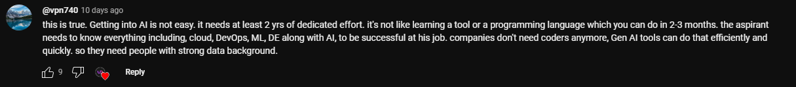
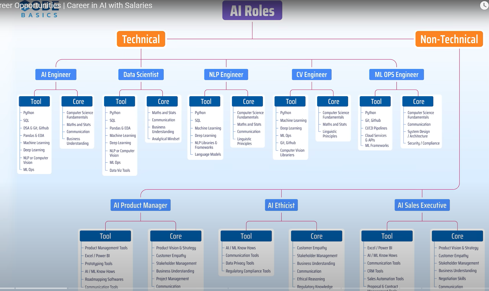

# Table of Contents
 
 
# Basic understanding
1. I will do freelancing on: Data Analyst, shofify, Facebook marketing

## Generative AI 
- content: 
  - Power of Generative AI 
- Source: 
  - [video-1](https://www.youtube.com/watch?v=rwF-X5STYks)
-   
-   
-   
- An MLOps engineer, or Machine Learning Operations engineer, is a developer who manages machine learning models, algorithms, and processes. 
- A new content created by AI is called Generative AI. 
- It creates text, images, music and videos etc.  
- Generative AI, or generative artificial intelligence, is a machine learning technique that uses algorithms to create new content like images, text, audio, music, and videos. 
- Generative AI is a type of AI that can create new content and ideas, including conversations, stories, images, videos, and music. It’s powered by machine learning (ML) models—very large models pre-trained on vast amounts of data and commonly referred to as foundation models (FMs). 
- Generative AI app builders 